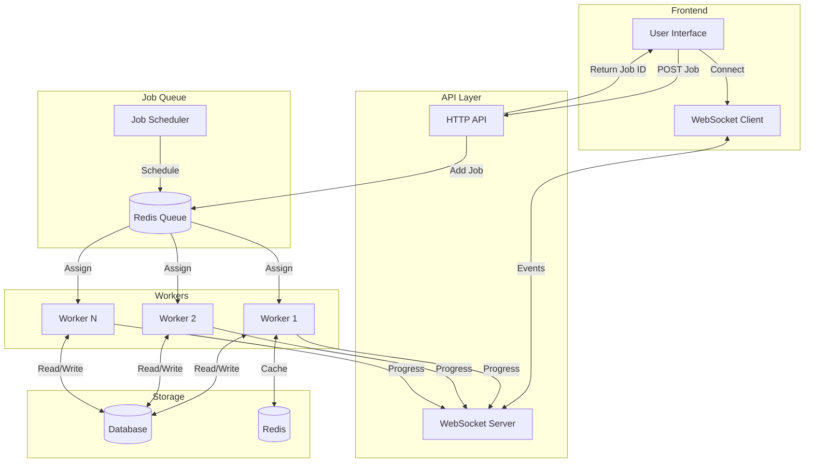

# Background Jobs & Long Running Tasks

**Version**: 1.0.0  
**Status**: Design Document  
**Letzte Aktualisierung**: Dezember 2024  
**Maintainer**: Thomas Heisig

---

## 📋 Überblick

Dieses Dokument beschreibt die Strategie zur Entkopplung von lang laufenden Aufgaben
vom HTTP-Request-Lifecycle und die Implementierung eines Job-Queue-Systems.

---

## 🎯 Problem & Lösung

### Problem

**Aktuelle Situation**:
- Batch-Processing-Endpoints (AI-Annotator) werden synchron im HTTP-Request verarbeitet
- Timeout-Risiko bei vielen Items (> 100)
- Blockiert Worker-Thread während Verarbeitung
- Keine Priorisierung oder Retry-Logik
- Schwierig skalierbar bei hoher Last

**Limitationen**:
```typescript
// Aktuell: Synchron im HTTP-Request
app.post('/api/ai-annotator/batch', async (req, res) => {
  const items = req.body.items; // 100 items
  
  // Problem: Blockiert bis alle Items fertig sind
  for (const item of items) {
    await processItem(item); // 2-5 Sekunden pro Item
  }
  
  // Risiko: HTTP Timeout nach 30-60 Sekunden
  res.json({ success: true });
});
```

### Lösung

**Entkopplung mit Job Queue**:
1. HTTP-Request erstellt Job
2. Job wird in Queue eingereiht
3. Worker-Prozess verarbeitet Jobs asynchron
4. Status-Updates via WebSocket oder Polling

```typescript
// Neu: Asynchron mit Job Queue
app.post('/api/ai-annotator/batch', async (req, res) => {
  const items = req.body.items;
  
  // Erstelle Job in Queue
  const job = await jobQueue.add('ai-annotate-batch', {
    items,
    userId: req.user.id,
  });
  
  // Sofortige Response
  res.status(202).json({
    success: true,
    jobId: job.id,
    status: 'queued',
  });
});

// Worker verarbeitet Job asynchron
jobQueue.process('ai-annotate-batch', async (job) => {
  const { items, userId } = job.data;
  
  for (const item of items) {
    await processItem(item);
    await job.updateProgress(++processed / items.length);
  }
});
```

---

## 🏗️ Architecture

### System Components



---

## 📦 Technology Options

### Option 1: BullMQ (Recommended)

**Vorteile**:
- ✅ Production-ready mit Redis
- ✅ Built-in Retry-Logik
- ✅ Job Prioritization
- ✅ Delayed Jobs
- ✅ Job Events (progress, completion)
- ✅ Web UI (Bull Board)
- ✅ TypeScript Support

**Installation**:
```bash
npm install bullmq ioredis
npm install --save-dev @types/bullmq
```

**Beispiel**:
```typescript
import { Queue, Worker } from 'bullmq';

// Queue erstellen
const batchQueue = new Queue('ai-batch', {
  connection: {
    host: 'localhost',
    port: 6379,
  },
});

// Job hinzufügen
const job = await batchQueue.add(
  'annotate',
  { items, userId },
  {
    priority: 1,
    attempts: 3,
    backoff: {
      type: 'exponential',
      delay: 2000,
    },
  }
);

// Worker erstellen
const worker = new Worker('ai-batch', async (job) => {
  const { items } = job.data;
  
  for (let i = 0; i < items.length; i++) {
    await processItem(items[i]);
    await job.updateProgress((i + 1) / items.length * 100);
  }
  
  return { processed: items.length };
});

// Events
worker.on('completed', (job) => {
  console.log(`Job ${job.id} completed`);
});

worker.on('failed', (job, err) => {
  console.error(`Job ${job.id} failed:`, err);
});
```

### Option 2: Bree

**Vorteile**:
- ✅ Lightweight
- ✅ Cron-style Scheduling
- ✅ Worker Threads Support
- ✅ Graceful Shutdown

**Nachteile**:
- ❌ Keine Job-Queue-Features
- ❌ Weniger Features als BullMQ

**Use Case**: Einfache Cron-Jobs, nicht für Batch-Processing

### Option 3: Agenda

**Vorteile**:
- ✅ MongoDB-basiert
- ✅ Einfache API

**Nachteile**:
- ❌ Braucht MongoDB (zusätzliche Dependency)
- ❌ Nicht Redis-basiert wie rest der App

---

## 🚀 Implementation Plan

### Phase 1: Setup (1-2 Tage)

#### 1.1 Install Dependencies
```bash
npm install bullmq ioredis
npm install --save-dev @types/bullmq @bull-board/api @bull-board/express
```

#### 1.2 Create Queue Service
```typescript
// apps/backend/src/services/queueService.ts
import { Queue, QueueOptions } from 'bullmq';
import { createLogger } from '../utils/logger.js';

const logger = createLogger('queue');

const queueOptions: QueueOptions = {
  connection: {
    host: process.env.REDIS_HOST || 'localhost',
    port: parseInt(process.env.REDIS_PORT || '6379', 10),
  },
  defaultJobOptions: {
    attempts: 3,
    backoff: {
      type: 'exponential',
      delay: 2000,
    },
    removeOnComplete: {
      age: 24 * 3600, // Keep completed jobs for 24 hours
      count: 1000,    // Keep last 1000 jobs
    },
    removeOnFail: {
      age: 7 * 24 * 3600, // Keep failed jobs for 7 days
    },
  },
};

// AI Batch Queue
export const aiBatchQueue = new Queue('ai-batch', queueOptions);

// Export Queue
export const exportQueue = new Queue('export', queueOptions);

// Email Queue
export const emailQueue = new Queue('email', queueOptions);

logger.info('Job queues initialized');
```

#### 1.3 Create Worker Service
```typescript
// apps/backend/src/services/workerService.ts
import { Worker, Job } from 'bullmq';
import { createLogger } from '../utils/logger.js';
import { websocketService } from './websocketService.js';

const logger = createLogger('worker');

// AI Batch Worker
const aiBatchWorker = new Worker('ai-batch', async (job: Job) => {
  logger.info({ jobId: job.id }, 'Processing AI batch job');
  
  const { items, userId } = job.data;
  let processed = 0;
  
  for (const item of items) {
    // Process item
    await processItem(item);
    processed++;
    
    // Update progress
    const progress = (processed / items.length) * 100;
    await job.updateProgress(progress);
    
    // Send WebSocket update
    websocketService.toUser(userId, 'batch:progress', {
      jobId: job.id,
      progress,
      processed,
      total: items.length,
    });
  }
  
  return { processed };
});

// Worker Events
aiBatchWorker.on('completed', (job) => {
  logger.info({ jobId: job.id }, 'Job completed');
  websocketService.toUser(job.data.userId, 'batch:complete', {
    jobId: job.id,
    result: job.returnvalue,
  });
});

aiBatchWorker.on('failed', (job, err) => {
  logger.error({ jobId: job?.id, error: err }, 'Job failed');
  if (job) {
    websocketService.toUser(job.data.userId, 'batch:error', {
      jobId: job.id,
      error: err.message,
    });
  }
});

// Graceful Shutdown
process.on('SIGTERM', async () => {
  await aiBatchWorker.close();
});

export { aiBatchWorker };
```

---

### Phase 2: API Integration (1 Tag)

#### 2.1 Update Batch Endpoint
```typescript
// apps/backend/src/routes/aiAnnotatorRouter/aiAnnotatorRouter.ts
import { aiBatchQueue } from '../../services/queueService.js';

router.post('/batch', authenticateToken, strictAiRateLimiter, asyncHandler(async (req, res) => {
  const validated = batchSchema.parse(req.body);
  
  // Add job to queue
  const job = await aiBatchQueue.add('annotate', {
    items: validated.items,
    formSchema: validated.formSchema,
    options: validated.options,
    userId: req.user.id,
  }, {
    priority: 1, // High priority
  });
  
  res.status(202).json({
    success: true,
    jobId: job.id,
    status: 'queued',
    message: 'Job queued for processing',
  });
}));

// Status endpoint
router.get('/batch/:jobId/status', authenticateToken, asyncHandler(async (req, res) => {
  const job = await aiBatchQueue.getJob(req.params.jobId);
  
  if (!job) {
    throw new NotFoundError('Job not found');
  }
  
  const state = await job.getState();
  const progress = job.progress;
  
  res.json({
    success: true,
    job: {
      id: job.id,
      state,
      progress,
      data: job.data,
      returnvalue: job.returnvalue,
    },
  });
}));
```

---

### Phase 3: Monitoring & UI (1 Tag)

#### 3.1 Bull Board Integration
```typescript
// apps/backend/src/index.ts
import { createBullBoard } from '@bull-board/api';
import { BullMQAdapter } from '@bull-board/api/bullMQAdapter';
import { ExpressAdapter } from '@bull-board/express';
import { aiBatchQueue, exportQueue } from './services/queueService.js';

const serverAdapter = new ExpressAdapter();
serverAdapter.setBasePath('/admin/queues');

createBullBoard({
  queues: [
    new BullMQAdapter(aiBatchQueue),
    new BullMQAdapter(exportQueue),
  ],
  serverAdapter,
});

// Mount Bull Board (Admin-only)
app.use('/admin/queues', authenticateAdmin, serverAdapter.getRouter());
```

#### 3.2 Prometheus Metrics
```typescript
// apps/backend/src/services/monitoring/queueMetrics.ts
import { register, Gauge, Counter } from 'prom-client';
import { aiBatchQueue } from '../queueService.js';

const jobsWaiting = new Gauge({
  name: 'queue_jobs_waiting',
  help: 'Number of jobs waiting in queue',
  labelNames: ['queue'],
  registers: [register],
});

const jobsActive = new Gauge({
  name: 'queue_jobs_active',
  help: 'Number of jobs currently being processed',
  labelNames: ['queue'],
  registers: [register],
});

const jobsCompleted = new Counter({
  name: 'queue_jobs_completed_total',
  help: 'Total number of completed jobs',
  labelNames: ['queue'],
  registers: [register],
});

const jobsFailed = new Counter({
  name: 'queue_jobs_failed_total',
  help: 'Total number of failed jobs',
  labelNames: ['queue'],
  registers: [register],
});

// Update metrics every 10 seconds
setInterval(async () => {
  const counts = await aiBatchQueue.getJobCounts();
  
  jobsWaiting.set({ queue: 'ai-batch' }, counts.waiting);
  jobsActive.set({ queue: 'ai-batch' }, counts.active);
  jobsCompleted.inc({ queue: 'ai-batch' }, counts.completed);
  jobsFailed.inc({ queue: 'ai-batch' }, counts.failed);
}, 10000);
```

---

## 📊 Job Types & Configuration

### AI Batch Annotation
```typescript
{
  name: 'ai-batch-annotate',
  priority: 1,
  attempts: 3,
  backoff: { type: 'exponential', delay: 2000 },
  timeout: 300000, // 5 minutes
}
```

### Data Export
```typescript
{
  name: 'export-data',
  priority: 2,
  attempts: 2,
  timeout: 120000, // 2 minutes
}
```

### Email Sending
```typescript
{
  name: 'send-email',
  priority: 3,
  attempts: 5,
  backoff: { type: 'exponential', delay: 1000 },
}
```

### Scheduled Report
```typescript
{
  name: 'generate-report',
  repeat: {
    cron: '0 9 * * 1', // Every Monday at 9 AM
  },
  priority: 2,
}
```

---

## 🔐 Security & Best Practices

### 1. User Isolation
- Jobs speichern userId
- Worker prüft Berechtigung
- Results nur für Job-Owner sichtbar

### 2. Resource Limits
- Max Concurrency per Queue
- Max Job Size (Payload)
- Timeout per Job

### 3. Error Handling
- Retry mit Exponential Backoff
- Dead Letter Queue für failed Jobs
- Alerting bei hoher Failure-Rate

### 4. Monitoring
- Job Queue Length
- Processing Time
- Failure Rate
- Worker Health

---

## 📚 Verwandte Dokumente

- [AI-Annotator Flow](./architecture/AI-ANNOTATOR-FLOW.md)
- [Architecture](./ARCHITECTURE.md)
- [Performance Features](./PERFORMANCE_FEATURES.md)
- [Redis Configuration](./REDIS_CONFIGURATION.md)

---

**Letzte Aktualisierung**: Dezember 2024  
**Maintainer**: Thomas Heisig  
**Nächster Review**: März 2025
