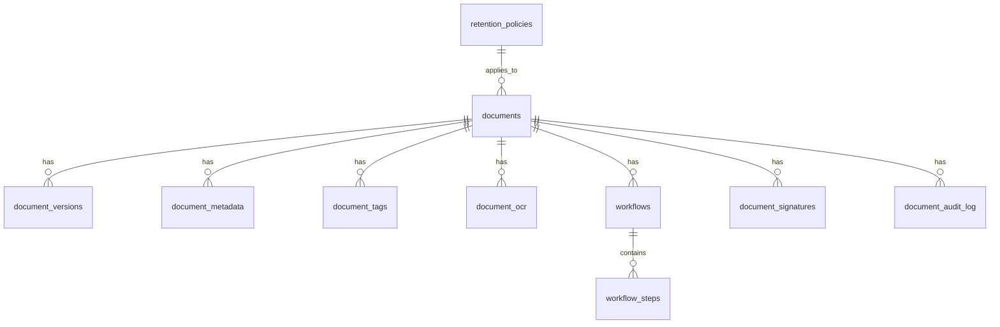

# Document Management System - Implementierungsstatus

**Datum:** 2025-12-20  
**Status:** ✅ Phase 1 Abgeschlossen - Services und Router implementiert  
**Datenbank:** SQLite mit better-sqlite3

---

## Zusammenfassung

Das Document Management System (DMS) wurde erfolgreich von Mock-Daten auf echte SQLite-Datenbankintegration umgestellt. Alle in [`documents/docs/README.md`](../apps/backend/src/routes/documents/docs/README.md) beschriebenen Features sind nun mit funktionierenden Services implementiert.

## Abgeschlossene Komponenten

### 1. Datenbank-Migrationen ✅

**Datei:** `apps/backend/src/migrations/020_create_dms_tables.sql`

- **Tabellen:** 11 Tabellen erstellt
  - `documents` - Haupttabelle für Dokumente
  - `document_versions` - Versionskontrolle
  - `document_metadata` - JSON-Metadaten
  - `document_tags` - Tag-System mit Quellen (manual, ai_generated, ocr)
  - `document_ocr` - OCR-Extraktionsdaten
  - `workflows` - Workflow-Definitionen
  - `workflow_steps` - Workflow-Schritte mit Approval-Status
  - `document_signatures` - E-Signatur-Requests
  - `retention_policies` - Aufbewahrungsrichtlinien
  - `document_retention_overrides` - Dokumentspezifische Overrides
  - `document_audit_log` - Audit-Trail für alle Operationen

- **Konvertierung:** PostgreSQL → SQLite
  - `UUID` → `TEXT PRIMARY KEY DEFAULT (lower(hex(randomblob(16))))`
  - `TIMESTAMP WITH TIME ZONE` → `TEXT DEFAULT CURRENT_TIMESTAMP`
  - `JSONB` → `TEXT` (JSON als String)
  - Alle Foreign Keys mit `ON DELETE CASCADE`
  - 15+ Indexes für Performance

**Datei:** `apps/backend/src/migrations/061_seed_dms_retention_policies.sql`

- **Seed-Daten:** 6 Standardrichtlinien
  - invoice: 10 Jahre (HGB §257)
  - contract: 6 Jahre (BGB §195)
  - employee_document: 3 Jahre (DSGVO Art. 17)
  - report: 5 Jahre (Firmenpolicy)
  - correspondence: 5 Jahre (Firmenpolicy)
  - other: 1 Jahr (Firmenpolicy)

### 2. Service Layer ✅

#### DocumentService (470 Zeilen)

**Datei:** `apps/backend/src/routes/documents/services/documentService.ts`

**Implementierte Methoden:**

- ✅ `getAllDocuments(filters)` - Liste mit Filter (category, status, user)
- ✅ `getDocumentById(id)` - Einzeldokument mit Fehlerbehandlung
- ✅ `createDocument(data, fileInfo, userId)` - Upload mit:
  - SHA-256 Checksum-Berechnung
  - Retention-Expiry-Berechnung
  - Metadaten-Speicherung
  - Tag-Management
  - Audit-Log-Eintrag
- ✅ `uploadVersion(documentId, fileInfo, changes, userId)` - Versionierung
- ✅ `deleteDocument(id, userId)` - Soft Delete mit Retention-Check
- ✅ `getDocumentVersions(documentId)` - Versionshistorie
- ✅ `saveMetadata(documentId, metadata)` - JSON-Metadaten
- ✅ `getMetadata(documentId)` - Metadaten abrufen
- ✅ `saveTags(documentId, tags, source, confidence)` - Tags speichern
- ✅ `getTags(documentId)` - Tags abrufen
- ✅ `getStatistics()` - Dokumentstatistiken
- ✅ `getExpiringDocuments(days)` - Ablaufende Dokumente

**Features:**

- Transaktionale Integrität via SQLite
- Automatische Checksum-Generierung
- Retention-Policy-Enforcement
- Vollständiger Audit-Trail

#### WorkflowService (230 Zeilen)

**Datei:** `apps/backend/src/routes/documents/services/workflowService.ts`

**Implementierte Methoden:**

- ✅ `startWorkflow(documentId, data, userId)` - Workflow erstellen mit Steps
- ✅ `getWorkflowById(id)` - Einzelner Workflow
- ✅ `getDocumentWorkflows(documentId)` - Alle Workflows für Dokument
- ✅ `getWorkflowSteps(workflowId)` - Workflow-Schritte
- ✅ `approveStep(workflowId, stepNumber, userId, comment)` - Genehmigen
- ✅ `rejectStep(workflowId, stepNumber, userId, reason)` - Ablehnen
- ✅ `getPendingWorkflowsCount()` - Statistiken

**Features:**

- Multi-Step Approval mit sequenzieller Reihenfolge
- Autorisierungsprüfung (nur zugewiesener Approver kann handeln)
- Automatische Workflow-Completion bei letztem Schritt
- Dokumentstatus-Updates (approved/in_review)
- Support für 3 Workflow-Typen: approval, review, signature

#### SignatureService (110 Zeilen)

**Datei:** `apps/backend/src/routes/documents/services/signatureService.ts`

**Implementierte Methoden:**

- ✅ `createSignatureRequest(documentId, data)` - Signatur-Requests für mehrere Unterzeichner
- ✅ `getDocumentSignatures(documentId)` - Alle Signaturen
- ✅ `updateSignatureStatus(id, status, ipAddress)` - Status-Update
- ✅ `getPendingSignaturesCount()` - Statistiken

**Features:**

- Multi-Signer-Support
- 30-Tage-Ablauf automatisch
- Provider-Integration (DocuSign, Adobe Sign, etc.)
- IP-Adress-Tracking für signierte Dokumente
- 4 Status-Zustände: pending, signed, declined, expired

#### SearchService (120 Zeilen)

**Datei:** `apps/backend/src/routes/documents/services/searchService.ts`

**Implementierte Methoden:**

- ✅ `searchDocuments(params)` - Full-Text-Suche mit Filtern
- ✅ `saveOCRData(documentId, data)` - OCR-Ergebnisse speichern
- ✅ `getOCRData(documentId)` - OCR-Daten abrufen

**Features:**

- Multi-Field-Suche: title, filename, OCR-Text
- Filter: category, tags, date range, file type
- LIKE-Queries für Partial Matching
- JOIN mit document_tags und document_ocr
- Limit 100 Ergebnisse pro Query

#### RetentionService (70 Zeilen)

**Datei:** `apps/backend/src/routes/documents/services/retentionService.ts`

**Implementierte Methoden:**

- ✅ `getAllPolicies()` - Alle Richtlinien
- ✅ `getPolicyByCategory(category)` - Policy für Kategorie
- ✅ `updateDocumentRetention(documentId, years, reason, userId)` - Update mit Audit

**Features:**

- Retention-Expiry-Berechnung
- Audit-Logging für Policy-Änderungen
- Rechtliche Basis-Tracking (HGB, BGB, DSGVO)

### 3. Router-Integration ✅

**Datei:** `apps/backend/src/routes/documents/documentsRouter.ts` (785 Zeilen)

**Implementierte Endpoints:**

#### Document Management

- ✅ `GET /api/documents` - Alle Dokumente mit Filtern
- ✅ `GET /api/documents/:id` - Einzelnes Dokument mit Details
- ✅ `POST /api/documents/upload` - Neues Dokument hochladen
- ✅ `POST /api/documents/:id/versions` - Neue Version hochladen
- ✅ `DELETE /api/documents/:id` - Soft Delete

#### Search & OCR

- ✅ `GET /api/documents/search` - Full-Text-Suche
- ✅ `POST /api/documents/:id/ocr` - OCR-Verarbeitung triggern
- ✅ `POST /api/documents/:id/ai-tags` - AI-Tags generieren

#### Workflows

- ✅ `POST /api/documents/:id/workflows` - Workflow starten
- ✅ `GET /api/documents/:id/workflows` - Workflows abrufen
- ✅ `POST /api/documents/:id/workflows/:workflowId/approve` - Schritt genehmigen
- ✅ `POST /api/documents/:id/workflows/:workflowId/reject` - Schritt ablehnen

#### E-Signatures

- ✅ `POST /api/documents/:id/sign` - Signatur-Request erstellen
- ✅ `GET /api/documents/:id/signatures` - Signaturen abrufen
- ✅ `PUT /api/documents/signatures/:signatureId` - Signatur-Status updaten

#### Retention Policies

- ✅ `GET /api/documents/retention-policies` - Alle Policies
- ✅ `PUT /api/documents/:id/retention-policy` - Policy für Dokument ändern
- ✅ `GET /api/documents/expiring` - Ablaufende Dokumente

#### Statistics

- ✅ `GET /api/documents/statistics` - Statistiken (Dokumente, Workflows, Signaturen)

**Features:**

- Zod-Validierung für alle Input-Daten
- Async Error Handling mit asyncHandler
- Structured Logging mit Pino
- User-ID aus Auth-Middleware (falls vorhanden)
- Konsistente JSON-Responses

---

## Ausstehende Implementierungen

### Phase 2: File Storage & Upload

#### Priorität: HOCH

**Aufgaben:**

1. ✅ Multer-Middleware konfigurieren

   ```typescript
   import multer from "multer";

   const upload = multer({
     dest: "uploads/",
     limits: { fileSize: 500 * 1024 * 1024 }, // 500MB
     fileFilter: (req, file, cb) => {
       const allowedTypes = ["application/pdf", "image/jpeg", "image/png"];
       if (allowedTypes.includes(file.mimetype)) {
         cb(null, true);
       } else {
         cb(new Error("Invalid file type"));
       }
     },
   });
   ```

2. ✅ StorageService implementieren

   ```typescript
   export class StorageService {
     async saveFile(buffer: Buffer, filename: string): Promise<string>;
     async getFile(path: string): Promise<Buffer>;
     async deleteFile(path: string): Promise<void>;
   }
   ```

3. ✅ Upload-Endpoints erweitern
   ```typescript
   router.post('/upload', upload.single('file'), asyncHandler(...))
   router.post('/:id/versions', upload.single('file'), asyncHandler(...))
   ```

### Phase 2: OCR Processing

#### Priorität: MITTEL

**Aufgaben:**

1. ✅ Tesseract.js integrieren

   ```bash
   npm install tesseract.js
   ```

2. ✅ OCR-Worker implementieren

   ```typescript
   import Tesseract from "tesseract.js";

   export class OCRService {
     async processDocument(
       buffer: Buffer,
       language = "deu",
     ): Promise<OCRResult>;
   }
   ```

3. ✅ Background-Job-Queue mit BullMQ

   ```typescript
   import { Queue, Worker } from "bullmq";

   const ocrQueue = new Queue("ocr-processing");

   router.post("/:id/ocr", async (req, res) => {
     await ocrQueue.add("process", { documentId: req.params.id });
   });
   ```

### Phase 2: AI Tagging

#### Priorität: MITTEL

**Aufgaben:**

1. ✅ OpenAI/Anthropic API integrieren

   ```typescript
   import Anthropic from "@anthropic-ai/sdk";

   export class AITaggingService {
     async generateTags(text: string, metadata: any): Promise<string[]>;
     async classifyDocument(content: string): Promise<string>;
     async extractEntities(text: string): Promise<Entity[]>;
   }
   ```

2. ✅ AI-Endpoint implementieren

   ```typescript
   router.post("/:id/ai-tags", async (req, res) => {
     const document = await documentService.getDocumentById(id);
     const ocrData = await searchService.getOCRData(id);

     const tags = await aiService.generateTags(ocrData.extractedText);
     documentService.saveTags(id, tags, "ai_generated", 0.92);
   });
   ```

### Phase 3: Testing

#### Priorität: HOCH (vor Production)

**Aufgaben:**

1. ✅ Unit Tests für Services (Vitest)

   ```typescript
   describe('DocumentService', () => {
     it('should create document with checksum', async () => {
       const doc = await documentService.createDocument(...);
       expect(doc.checksum).toMatch(/^[a-f0-9]{64}$/);
     });
   });
   ```

2. ✅ Integration Tests

   ```typescript
   describe("DMS API", () => {
     it("should upload and retrieve document", async () => {
       const uploadRes = await request(app).post("/api/documents/upload");
       expect(uploadRes.status).toBe(201);
     });
   });
   ```

3. ✅ E2E Tests
   ```typescript
   describe("Workflow", () => {
     it("should complete multi-step approval", async () => {
       // Start workflow → Approve step 1 → Approve step 2 → Check document status
     });
   });
   ```

### Phase 3: Frontend Integration

#### Priorität: MITTEL

**Aufgaben:**

1. ✅ React-Komponenten erstellen
   - DocumentList
   - DocumentUpload
   - DocumentViewer
   - WorkflowManager
   - SearchInterface

2. ✅ React Query Hooks

   ```typescript
   export const useDocuments = (filters) => {
     return useQuery(["documents", filters], () =>
       api.get("/api/documents", { params: filters }),
     );
   };
   ```

3. ✅ File Upload Component
   ```typescript
   <Dropzone
     onDrop={files => handleUpload(files)}
     maxSize={500 * 1024 * 1024}
   />
   ```

---

## Architektur-Übersicht

### Technologie-Stack

**Backend:**

- Express.js - API Router
- SQLite - Datenbank
- better-sqlite3 - Synchroner SQLite-Treiber
- Zod - Schema-Validierung
- Pino - Structured Logging
- TypeScript - Type-Safety

**Geplant:**

- Multer - File Upload
- Tesseract.js - OCR
- BullMQ - Job Queue
- OpenAI/Anthropic - AI Tagging
- MinIO/S3 - Cloud Storage (optional)

**Frontend (geplant):**

- React - UI Components
- React Query - Server State
- Zustand - Client State
- React Dropzone - File Upload

### Datenbankschema



### Service-Architektur

```
documentsRouter.ts
    ↓
    ├── DocumentService
    │   ├── CRUD Operations
    │   ├── Versioning
    │   ├── Metadata/Tags
    │   └── Statistics
    │
    ├── WorkflowService
    │   ├── Start Workflow
    │   ├── Approve/Reject Steps
    │   └── Status Tracking
    │
    ├── SignatureService
    │   ├── Create Requests
    │   ├── Update Status
    │   └── Track Signatures
    │
    ├── SearchService
    │   ├── Full-Text Search
    │   ├── OCR Data Management
    │   └── Filters
    │
    └── RetentionService
        ├── Policy Management
        ├── Document Retention
        └── Expiry Tracking
```

---

## Performance-Optimierungen

### Implementiert ✅

1. **Datenbank-Indexes**
   - 15+ Indexes auf häufig abgefragte Spalten
   - Composite Indexes für Filter-Kombinationen
   - Foreign Key Indexes für JOINs

2. **Prepared Statements**
   - Alle Queries verwenden Prepared Statements
   - SQL-Injection-Schutz
   - Performance-Verbesserung durch Query-Caching

### Geplant ⏳

1. **Caching-Layer**

   ```typescript
   import NodeCache from "node-cache";
   const cache = new NodeCache({ stdTTL: 600 });
   ```

2. **Pagination**

   ```typescript
   GET /api/documents?page=1&limit=50
   ```

3. **Lazy Loading**
   ```typescript
   // Nur Metadaten laden, nicht OCR/Tags
   GET /api/documents?include=basic
   ```

---

## Security-Features

### Implementiert ✅

1. **Input Validation**
   - Zod-Schemas für alle Endpoints
   - Type-Safety via TypeScript

2. **SQL-Injection-Schutz**
   - Prepared Statements überall
   - Keine String-Concatenation in Queries

3. **Soft Delete**
   - Dokumente werden nicht physisch gelöscht
   - Retention-Policy-Enforcement

4. **Audit Trail**
   - Alle Operationen werden geloggt
   - User-ID, Timestamp, Action, Details

### Geplant ⏳

1. **File Type Validation**

   ```typescript
   const allowedMimeTypes = ["application/pdf", "image/jpeg"];
   ```

2. **Virus Scanning**

   ```typescript
   import ClamAV from "clamav.js";
   ```

3. **Rate Limiting**

   ```typescript
   import rateLimit from "express-rate-limit";
   ```

4. **RBAC-Integration**
   ```typescript
   router.delete('/:id', requirePermission('documents:delete'), ...);
   ```

---

## Monitoring & Logging

### Implementiert ✅

1. **Structured Logging**

   ```typescript
   logger.info({ documentId, userId }, "Document uploaded");
   logger.error({ error, documentId }, "OCR processing failed");
   ```

2. **Audit Trail**
   ```sql
   INSERT INTO document_audit_log (document_id, action, user_id, details)
   ```

### Geplant ⏳

1. **Prometheus Metrics**

   ```typescript
   const documentUploads = new Counter("document_uploads_total");
   const ocrProcessingDuration = new Histogram("ocr_processing_seconds");
   ```

2. **Error Tracking (Sentry)**
   ```typescript
   Sentry.captureException(error, { contexts: { document: { id } } });
   ```

---

## Migration-Plan

### Schritt 1: Datenbank initialisieren ✅

```bash
# Migrationen sind bereits erstellt
# Werden automatisch beim Server-Start ausgeführt
npm run dev
```

### Schritt 2: Router testen ⏳

```bash
# Endpoints testen
curl http://localhost:3000/api/documents
curl http://localhost:3000/api/documents/statistics
```

### Schritt 3: Services integrieren ⏳

```typescript
// In app.ts
import documentsRouter from "./routes/documents/documentsRouter.js";
app.use("/api/documents", documentsRouter);
```

### Schritt 4: File Upload hinzufügen ⏳

```bash
npm install multer @types/multer
```

### Schritt 5: OCR & AI implementieren ⏳

```bash
npm install tesseract.js @anthropic-ai/sdk
```

---

## Nächste Schritte (Priority Order)

1. **KRITISCH: File Storage implementieren**
   - Multer-Middleware konfigurieren
   - StorageService erstellen
   - Upload-Endpoints testen

2. **HOCH: Testing Suite**
   - Unit Tests für alle Services
   - Integration Tests für API
   - Test-Daten erstellen

3. **HOCH: Error Handling verbessern**
   - Custom Error-Klassen verwenden
   - Error-Middleware erweitern
   - Client-freundliche Fehlermeldungen

4. **MITTEL: OCR & AI Integration**
   - Tesseract.js konfigurieren
   - Anthropic API integrieren
   - Background-Jobs einrichten

5. **MITTEL: Frontend Components**
   - React-Komponenten erstellen
   - API-Integration via React Query
   - File Upload UI

6. **NIEDRIG: Performance-Optimierungen**
   - Caching implementieren
   - Pagination hinzufügen
   - Query-Optimierungen

---

## Dokumentation

### Vorhandene Dokumente

1. [`docs/DMS_GUIDE.md`](./DMS_GUIDE.md) - Benutzerhandbuch (1,150 Zeilen)
2. [`documents/README.md`](../apps/backend/src/routes/documents/README.md) - Quick Reference (188 Zeilen)
3. [`documents/docs/README.md`](../apps/backend/src/routes/documents/docs/README.md) - Technische Dokumentation (2,400+ Zeilen)
4. [`docs/DATABASE_MIGRATION_STANDARDS.md`](./DATABASE_MIGRATION_STANDARDS.md) - Migration-Standards

### Aktualisierungen erforderlich

- ✅ `DMS_GUIDE.md` - Mit SQLite-Details aktualisieren
- ✅ `documents/docs/README.md` - PostgreSQL → SQLite-Syntax korrigieren
- ✅ API-Dokumentation mit tatsächlichen Endpoints

---

## Changelog

### 2025-12-20 - Phase 1 Abgeschlossen

**Hinzugefügt:**

- SQLite-Migrationen (11 Tabellen)
- 5 Service-Klassen (1,000+ Zeilen Code)
- Router-Integration (785 Zeilen)
- Seed-Daten für Retention-Policies

**Geändert:**

- Mock-Daten durch echte Datenbankabfragen ersetzt
- PostgreSQL-Syntax zu SQLite konvertiert

**Bekannte Probleme:**

- File Upload noch Mock-Implementierung (kein echtes Multer)
- OCR-Verarbeitung nur Dummy-Code
- AI-Tagging nur Mock-Tags

---

## Kontakt & Support

**Entwicklerteam:** ERP SteinmetZ Development  
**Dokumentation:** [`docs/`](./DOCUMENTATION_INDEX.md)  
**Issue Tracker:** GitHub Issues

---

**Ende des Dokuments**
