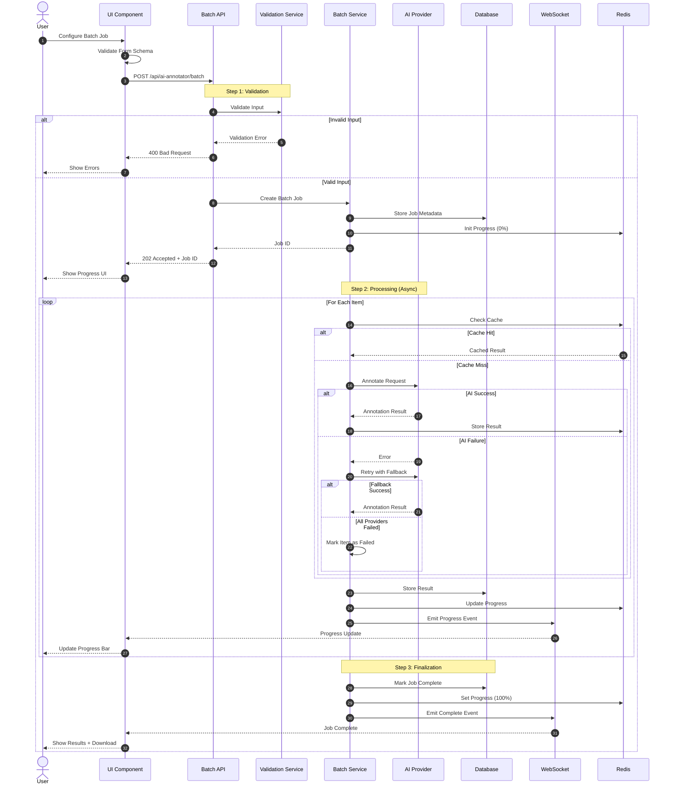
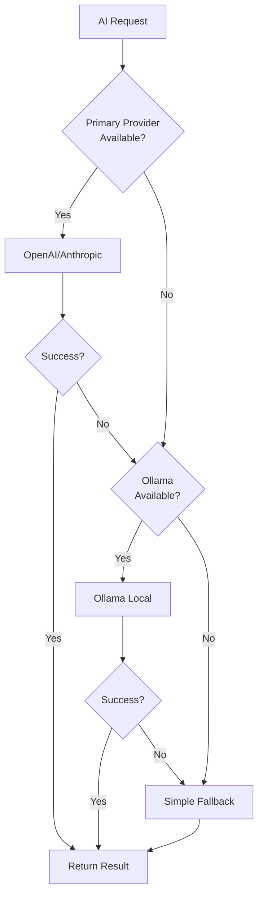

# AI-Annotator Data Flow

**Version**: 1.0.0  
**Status**: Production Ready  
**Letzte Aktualisierung**: Dezember 2024  
**Maintainer**: Thomas Heisig

---

## 📋 Überblick

Dieses Dokument beschreibt den Datenfluss des AI-Annotators, der automatische
Annotation und Strukturierung von unstrukturierten Daten ermöglicht.

---

## 🎯 AI-Annotator Architecture

```mermaid
graph TB
    subgraph "Frontend"
        UI[AI-Annotator UI]
        Form[Batch-Form-Config]
        Preview[Live Preview]
    end

    subgraph "API Layer"
        BatchAPI[/api/ai-annotator/batch]
        StatusAPI[/api/ai-annotator/status]
        TemplateAPI[/api/ai-annotator/templates]
    end

    subgraph "Backend Services"
        BatchService[Batch Processing Service]
        AIService[AI Provider Service]
        ValidationService[Validation Service]
        CacheService[Cache Service]
    end

    subgraph "AI Providers"
        OpenAI[OpenAI GPT-4]
        Anthropic[Claude-3]
        Ollama[Local Ollama]
        Fallback[Fallback Provider]
    end

    subgraph "Data Storage"
        DB[(Database)]
        Redis[(Redis Cache)]
        Queue[(Processing Queue)]
    end

    UI --> Form
    UI --> Preview
    Form --> BatchAPI
    Preview --> StatusAPI
    
    BatchAPI --> BatchService
    BatchService --> ValidationService
    ValidationService --> AIService
    
    AIService --> OpenAI
    AIService --> Anthropic
    AIService --> Ollama
    AIService --> Fallback
    
    BatchService --> DB
    BatchService --> Queue
    CacheService --> Redis
    
    StatusAPI --> Queue
    StatusAPI --> Redis
    TemplateAPI --> DB
```

---

## 🔄 Batch Processing Flow



---

## 📝 Detailed Steps

### Phase 1: Job Configuration

#### 1. User Configuration
**UI Components**:
- Form Schema Builder
- Field Mapping
- Sample Data Preview
- Validation Rules

**Configuration Options**:
```typescript
interface BatchConfig {
  name: string;                    // Job Name
  description?: string;            // Job Description
  formSchema: FormSpec;            // Target Schema
  items: Array<{                   // Items to Process
    id: string;
    rawData: unknown;              // Unstructured Data
  }>;
  options: {
    aiProvider?: 'openai' | 'anthropic' | 'ollama';
    model?: string;
    temperature?: number;          // 0.0 - 1.0
    maxRetries?: number;           // Default: 3
    batchSize?: number;            // Default: 10
    cacheResults?: boolean;        // Default: true
  };
}
```

**Example Configuration**:
```typescript
{
  name: "Customer Data Import",
  formSchema: {
    fields: [
      { name: "customerName", type: "text", required: true },
      { name: "email", type: "email", required: true },
      { name: "phone", type: "tel", required: false },
      { name: "address", type: "textarea", required: false }
    ]
  },
  items: [
    { id: "1", rawData: "Hans Müller, hans@example.com, Tel: 0123..." },
    { id: "2", rawData: "Maria Schmidt, maria@test.de, ..." }
  ],
  options: {
    aiProvider: "openai",
    model: "gpt-4o-mini",
    temperature: 0.1,
    maxRetries: 3,
    cacheResults: true
  }
}
```

---

### Phase 2: Validation

#### Input Validation
**Checks**:
1. **Schema Validation**: FormSpec gegen Zod-Schema
2. **Item Count**: Max 100 Items per Batch (konfigurierbar)
3. **Data Size**: Max 10MB per Item
4. **Rate Limit**: Max 5 Batch-Jobs pro 15min
5. **User Permissions**: User hat Zugriff auf AI-Features

**Validation Errors**:
```typescript
{
  success: false,
  errors: [
    { field: "items", message: "Maximum 100 items allowed" },
    { field: "formSchema.fields[0].name", message: "Field name required" }
  ]
}
```

---

### Phase 3: Job Creation

#### Database Schema
```sql
CREATE TABLE ai_batch_jobs (
  id TEXT PRIMARY KEY,
  user_id TEXT NOT NULL,
  name TEXT NOT NULL,
  status TEXT NOT NULL,  -- pending, processing, completed, failed
  config_json TEXT NOT NULL,
  created_at TIMESTAMP DEFAULT CURRENT_TIMESTAMP,
  started_at TIMESTAMP,
  completed_at TIMESTAMP,
  
  total_items INTEGER NOT NULL,
  processed_items INTEGER DEFAULT 0,
  successful_items INTEGER DEFAULT 0,
  failed_items INTEGER DEFAULT 0,
  
  FOREIGN KEY (user_id) REFERENCES users(id)
);

CREATE TABLE ai_batch_items (
  id TEXT PRIMARY KEY,
  job_id TEXT NOT NULL,
  item_id TEXT NOT NULL,
  raw_data TEXT NOT NULL,
  result_json TEXT,
  error TEXT,
  status TEXT NOT NULL,  -- pending, processing, success, failed
  processed_at TIMESTAMP,
  
  FOREIGN KEY (job_id) REFERENCES ai_batch_jobs(id)
);
```

#### Job Status
```typescript
interface JobStatus {
  id: string;
  name: string;
  status: 'pending' | 'processing' | 'completed' | 'failed';
  progress: {
    total: number;
    processed: number;
    successful: number;
    failed: number;
    percentage: number;  // 0-100
  };
  timing: {
    createdAt: string;
    startedAt?: string;
    completedAt?: string;
    duration?: number;   // milliseconds
  };
}
```

---

### Phase 4: AI Processing

#### Request Structure
```typescript
// AI Prompt Template
const prompt = `
Extract structured data from the following text according to this schema:

SCHEMA:
${JSON.stringify(formSchema, null, 2)}

TEXT:
${rawData}

Return ONLY valid JSON matching the schema. Do not include explanations.
`;

// AI Request
const request = {
  model: 'gpt-4o-mini',
  messages: [
    { role: 'system', content: 'You are a data extraction assistant.' },
    { role: 'user', content: prompt }
  ],
  temperature: 0.1,
  response_format: { type: 'json_object' }
};
```

#### Provider Selection & Fallback


#### Retry Logic
```typescript
async function processWithRetry(
  item: BatchItem,
  maxRetries: number = 3
): Promise<AnnotationResult> {
  let lastError: Error;
  
  for (let attempt = 1; attempt <= maxRetries; attempt++) {
    try {
      const result = await aiProvider.annotate(item);
      return result;
    } catch (error) {
      lastError = error;
      
      if (attempt < maxRetries) {
        // Exponential backoff
        const delay = Math.pow(2, attempt) * 1000;
        await sleep(delay);
        
        // Try next provider on error
        aiProvider = getNextProvider();
      }
    }
  }
  
  throw lastError;
}
```

---

### Phase 5: Caching

#### Cache Strategy
**Cache Key Pattern**:
```
cache:ai-annotator:{schemaHash}:{dataHash}
```

**Cache Logic**:
1. Hash FormSchema → `schemaHash`
2. Hash rawData → `dataHash`
3. Check Cache: `GET cache:ai-annotator:{schemaHash}:{dataHash}`
4. If Hit: Return cached result
5. If Miss: Process with AI, then cache result

**TTL**: 24 hours (konfigurierbar)

**Cache Stats**:
```typescript
{
  hits: 42,
  misses: 18,
  hitRate: 0.7,  // 70%
  savedCost: "$1.25"  // Estimated AI API cost saved
}
```

---

### Phase 6: Progress Tracking

#### WebSocket Events
```typescript
// Progress Update
socket.emit('batch:progress', {
  jobId: 'job-123',
  progress: {
    total: 100,
    processed: 45,
    successful: 42,
    failed: 3,
    percentage: 45
  },
  currentItem: {
    id: 'item-45',
    status: 'processing'
  }
});

// Job Complete
socket.emit('batch:complete', {
  jobId: 'job-123',
  status: 'completed',
  results: {
    successful: 97,
    failed: 3,
    duration: 125000  // ms
  },
  downloadUrl: '/api/ai-annotator/batch/job-123/export'
});

// Job Failed
socket.emit('batch:error', {
  jobId: 'job-123',
  error: 'All AI providers unavailable'
});
```

#### UI Progress Display
```typescript
<ProgressBar
  value={progress.percentage}
  label={`${progress.processed} / ${progress.total} items`}
  status={
    progress.failed > 0 ? 'warning' : 'success'
  }
/>

<Statistics>
  <Stat label="Successful" value={progress.successful} />
  <Stat label="Failed" value={progress.failed} />
  <Stat label="Remaining" value={progress.total - progress.processed} />
</Statistics>
```

---

### Phase 7: Result Export

#### Export Formats
1. **JSON**: Structured Data as JSON Array
2. **CSV**: Flattened Table Format
3. **Excel**: With Formatting and Validation
4. **SQL**: INSERT Statements

**Export Endpoint**:
```
GET /api/ai-annotator/batch/:jobId/export?format=json
```

**Response**:
```typescript
{
  success: true,
  data: {
    jobId: 'job-123',
    results: [
      {
        itemId: 'item-1',
        rawData: 'Original text...',
        annotatedData: {
          customerName: 'Hans Müller',
          email: 'hans@example.com',
          phone: '0123456789'
        },
        confidence: 0.95,
        processingTime: 1250  // ms
      },
      // ... more results
    ],
    metadata: {
      totalItems: 100,
      successfulItems: 97,
      failedItems: 3,
      duration: 125000,
      aiProvider: 'openai',
      model: 'gpt-4o-mini',
      totalCost: 0.042  // USD
    }
  }
}
```

---

## 🔐 Security & Compliance

### Data Privacy
- **Option**: Lokale AI (Ollama) für sensitive Daten
- **Encryption**: Data at rest (Database)
- **Audit Trail**: Alle Annotationen geloggt
- **User Consent**: Disclaimer bei externen AI-Providern

### Rate Limiting
- **Batch Jobs**: 5 Jobs pro 15 Minuten
- **AI Requests**: 20 Requests pro 15 Minuten
- **Cost Control**: Max Budget per User/Job

---

## 📊 Monitoring

### Metrics
```prometheus
# Batch Job Metrics
ai_batch_jobs_total{status="completed"}
ai_batch_jobs_total{status="failed"}
ai_batch_job_duration_seconds

# Item Processing
ai_batch_items_total{status="success"}
ai_batch_items_total{status="failed"}
ai_batch_item_duration_seconds

# AI Provider
ai_provider_requests_total{provider="openai",result="success"}
ai_provider_requests_total{provider="openai",result="error"}
ai_provider_response_time_seconds{provider="openai"}

# Cache
ai_annotator_cache_hits_total
ai_annotator_cache_misses_total
ai_annotator_cache_hit_rate
```

### Alerts
- **High Failure Rate**: > 10% Items failed
- **Slow Processing**: > 5s per Item P95
- **AI Provider Down**: > 50% Error Rate
- **Cost Spike**: > 2x normal rate

---

## 📚 Verwandte Dokumente

- [AI-Annotator UI Guide](../AI_ANNOTATOR_UI_GUIDE.md)
- [AI-Annotator Workflow](../AI_ANNOTATOR_WORKFLOW.md)
- [AI Provider Documentation](../../apps/backend/src/routes/ai/docs/)
- [Request Flow](./REQUEST-FLOW.md)

---

**Letzte Aktualisierung**: Dezember 2024  
**Maintainer**: Thomas Heisig  
**Nächster Review**: März 2025
