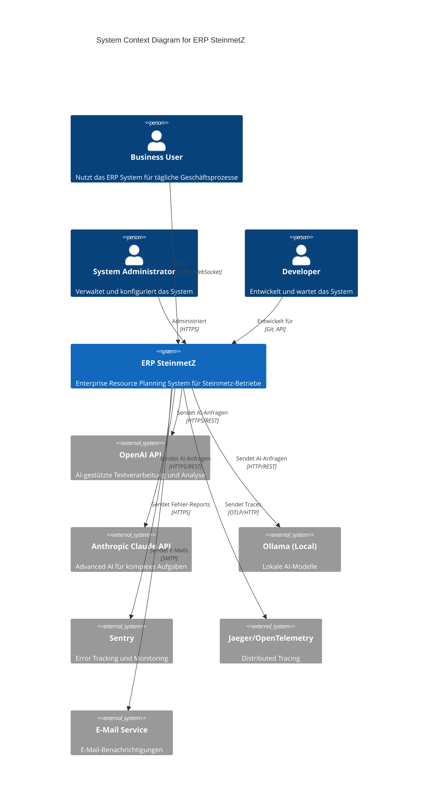

# C4 Model - Level 1: System Context

**Version**: 1.0.0  
**Status**: Production Ready  
**Letzte Aktualisierung**: Dezember 2024  
**Maintainer**: Thomas Heisig

---

## 📋 Überblick

Dieses Diagramm zeigt das ERP SteinmetZ System im Kontext seiner externen Benutzer
und Systeme (C4 Level 1 - System Context).

---

## 🎯 System Context Diagram

---

## 📝 Beschreibung

### Benutzer

#### Business User

- **Rolle**: Mitarbeiter im Steinmetz-Betrieb
- **Interaktion**:
  - Tägliche Arbeit mit dem ERP System
  - Verwaltung von Kunden, Aufträgen, Rechnungen
  - Nutzung der AI-Features für Dokumentverarbeitung
- **Zugriff**: Web-Browser (Frontend), HTTPS verschlüsselt

#### System Administrator

- **Rolle**: IT-Verantwortlicher
- **Interaktion**:
  - System-Konfiguration und -Wartung
  - Benutzer-Verwaltung
  - Monitoring und Fehleranalyse
- **Zugriff**: Admin-Dashboard, System-APIs

#### Developer

- **Rolle**: Software-Entwickler
- **Interaktion**:
  - Entwicklung neuer Features
  - Bug-Fixes und Wartung
  - API-Integration
- **Zugriff**: Git-Repository, Entwicklungs-APIs, Dokumentation

---

### Externe Systeme

#### AI-Provider

**OpenAI API**

- **Zweck**: Advanced AI für Text-Generation und -Analyse
- **Modelle**: GPT-4, GPT-4-Turbo, GPT-3.5-Turbo
- **Nutzung**: AI-Annotator, QuickChat, Dokumentenverarbeitung
- **Protokoll**: HTTPS REST API
- **Fallback**: Bei Ausfall → Anthropic oder Ollama

**Anthropic Claude API**

- **Zweck**: Alternative AI mit hoher Qualität
- **Modelle**: Claude-3-Opus, Claude-3-Sonnet
- **Nutzung**: Komplexe Analysen, lange Kontexte
- **Protokoll**: HTTPS REST API
- **Fallback**: Bei Ausfall → OpenAI oder Ollama

**Ollama (Local)**

- **Zweck**: Lokale AI ohne externe Abhängigkeiten
- **Modelle**: Qwen2.5, Llama, Mistral
- **Nutzung**: Privacy-sensitive Daten, Offline-Betrieb
- **Protokoll**: HTTP REST API (localhost)
- **Vorteil**: Keine API-Kosten, vollständige Datenkontrolle

#### Monitoring & Observability

**Sentry**

- **Zweck**: Error Tracking und Performance Monitoring
- **Daten**: Exception-Logs, Performance-Traces, User-Feedback
- **Protokoll**: HTTPS
- **Optional**: Kann deaktiviert werden (SENTRY_ENABLED=false)

**Jaeger / OpenTelemetry**

- **Zweck**: Distributed Tracing für Anfragen über Services
- **Daten**: Spans, Traces, Metriken
- **Protokoll**: OTLP/HTTP (Port 4318)
- **Optional**: Kann deaktiviert werden (OTEL_TRACES_ENABLED=false)

#### Communication

**E-Mail Service**

- **Zweck**: Benachrichtigungen an Benutzer
- **Nutzung**:
  - Passwort-Reset
  - Batch-Job-Completion
  - System-Warnungen
- **Protokoll**: SMTP
- **Konfiguration**: Über ENV-Variablen

---

## 🔐 Sicherheit

### Externe Verbindungen

1. **AI-Provider**:
   - API-Keys über ENV-Variablen
   - HTTPS verschlüsselt
   - Rate Limiting zum Kostenschutz

2. **Monitoring**:
   - Optional aktivierbar
   - DSN/Token-basierte Authentifizierung
   - Keine sensitiven Daten in Traces

3. **E-Mail**:
   - SMTP mit TLS
   - Authentifizierung erforderlich

### Datenschutz

- Lokale AI-Option (Ollama) für GDPR-Compliance
- Keine Personendaten in externen Monitoring-Systemen
- Opt-in für Sentry und Tracing

---

## 🚀 Deployment-Kontext

### Development

- Alle externen Services optional
- Ollama als Standard-AI-Provider
- Lokales Monitoring (optional)

### Production

- Redundante AI-Provider mit Fallback
- Sentry und Jaeger aktiviert
- E-Mail-Service konfiguriert
- Rate Limiting aktiv

---

## 📚 Verwandte Dokumente

- [C4 Level 2: Container Diagram](./C4-LEVEL2-CONTAINER.md)
- [Request Flow Diagram](./REQUEST-FLOW.md)
- [AI-Annotator Data Flow](./AI-ANNOTATOR-FLOW.md)
- [ARCHITECTURE.md](../ARCHITECTURE.md)

---

**Letzte Aktualisierung**: Dezember 2024  
**Maintainer**: Thomas Heisig  
**Nächster Review**: März 2025
