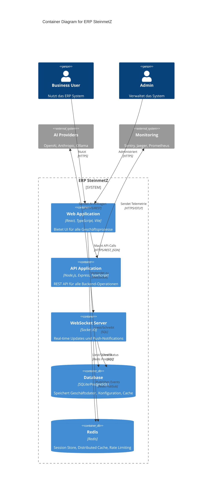
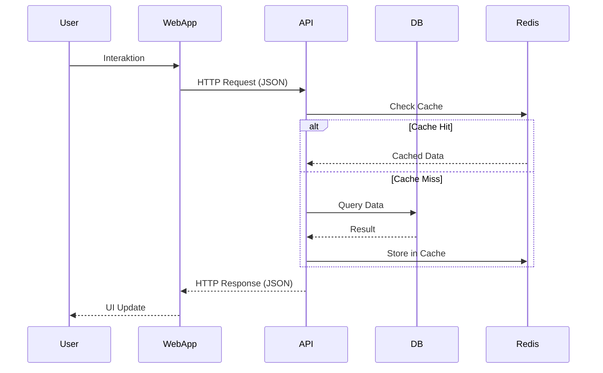
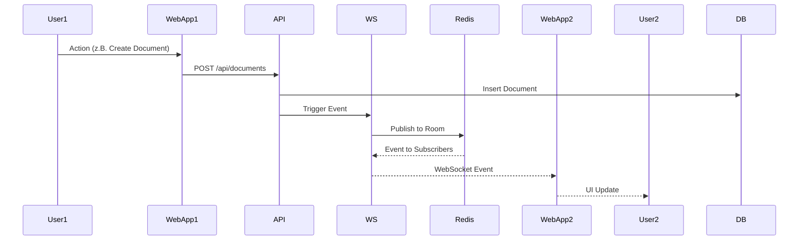
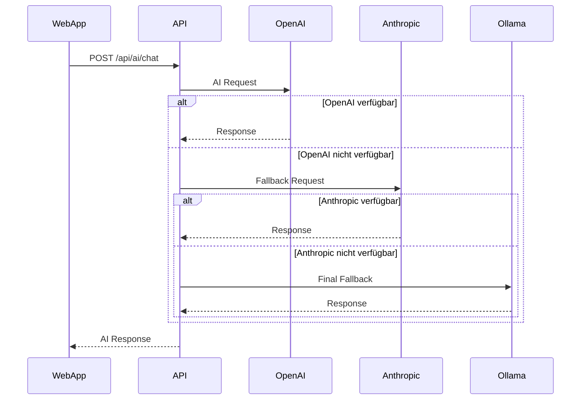

# C4 Model - Level 2: Container Diagram

**Version**: 1.0.0  
**Status**: Production Ready  
**Letzte Aktualisierung**: Dezember 2024  
**Maintainer**: Thomas Heisig

---

## 📋 Überblick

Dieses Diagramm zeigt die Container (Applikationen und Datenspeicher) innerhalb des
ERP SteinmetZ Systems (C4 Level 2 - Container Diagram).

---

## 🎯 Container Diagram



---

## 📦 Container-Beschreibungen

### Frontend Container

#### Web Application
- **Technologie**: React 18, TypeScript, Vite
- **Zweck**: Single-Page-Application (SPA) für alle UI-Interaktionen
- **Features**:
  - Dashboard mit Widgets
  - Modul-basierte Navigation (HR, Finance, Documents, etc.)
  - AI-Annotator UI
  - QuickChat Interface
  - Real-time Updates via WebSocket
- **Build**: Vite mit Code-Splitting und Lazy Loading
- **Deployment**: Statische Files (HTML, CSS, JS)
- **Port**: 5173 (dev), wird von Reverse Proxy bereitgestellt (prod)

**Key Components**:
```
/src
  /components
    /Dashboard      - Dashboard-Widgets und Grid
    /ui             - Shared UI Components (Button, Input, etc.)
  /features
    /documents      - Dokumentenverwaltung
    /hr             - HR-Modul
    /finance        - Finance-Modul
    /communication  - QuickChat, Phone Dialer
  /utils
    /logger         - Structured Logging
    /api            - API Client
```

---

### Backend Containers

#### API Application
- **Technologie**: Node.js 18+, Express 5, TypeScript
- **Zweck**: REST API für alle Backend-Operationen
- **Port**: 3000
- **Features**:
  - RESTful Endpoints für alle Module
  - Authentication & Authorization (JWT)
  - Rate Limiting (express-rate-limit)
  - Request Validation (Zod)
  - Error Handling & Logging
  - Metrics Collection (Prometheus)
  - Health Checks

**Router-Struktur**:
```
/api
  /auth             - Login, Register, Token Refresh
  /dashboard        - Dashboard-Daten
  /ai               - AI-Chat, Completion, Models
  /ai-annotator     - AI-Annotator Batch Processing
  /hr               - Mitarbeiter, Urlaub, Gehalt
  /finance          - Rechnungen, Buchhaltung, Reports
  /documents        - Dokumentenverwaltung
  /quickchat        - QuickChat Nachrichten
  /calendar         - Termine, Events
  /system           - System-Info, Configuration
  /health           - Liveness, Readiness Probes
  /metrics          - Prometheus Metrics
```

**Services**:
- `authService` - User Authentication
- `dbService` - Database Abstraction
- `aiProviderHealthService` - AI Provider Health Checks
- `tracingService` - OpenTelemetry Tracing
- `errorTrackingService` - Sentry Integration
- `websocketService` - WebSocket Management
- `shutdownManager` - Graceful Shutdown

---

#### WebSocket Server
- **Technologie**: Socket.IO 4
- **Zweck**: Real-time bidirektionale Kommunikation
- **Port**: 3000 (same as API, Socket.IO upgrade)
- **Features**:
  - JWT-basierte Authentifizierung
  - Room-based Broadcasting
  - Event-Types:
    - `dashboard:update` - Dashboard-Updates
    - `chat:message` - Chat-Nachrichten
    - `system:notification` - System-Benachrichtigungen
    - `batch:progress` - Batch-Processing-Updates
    - `catalog:update` - Functions-Catalog-Changes

**Event-Flow**:
```
Client → WebSocket → Server
         (connect, auth)
Server → WebSocket → Client
         (events, broadcasts)
```

---

### Data Storage Containers

#### Database
- **Technologie**: SQLite (dev), PostgreSQL (prod)
- **Zweck**: Persistente Speicherung aller Geschäftsdaten
- **Port**: 5432 (PostgreSQL)
- **Schema**:
  - `users` - Benutzer und Authentication
  - `sessions` - Session-Daten (wenn Redis nicht verfügbar)
  - `functions_nodes` - Functions-Catalog
  - `functions_edges` - Functions-Relationships
  - `ai_annotations` - AI-Annotator-Daten
  - `documents` - Dokumenten-Metadaten
  - `hr_*` - HR-Modul-Tabellen
  - `finance_*` - Finance-Modul-Tabellen
  - `audit_trail` - Audit-Logs für Compliance

**Migrations**:
- Automatisch bei Startup (dbService.init())
- Versioniert mit Schema-Checksums
- Rollback-fähig

---

#### Redis
- **Technologie**: Redis 7+
- **Zweck**: Distributed Cache, Session Store, PubSub
- **Port**: 6379
- **Use Cases**:
  1. **Session Store**: Express-Sessions mit `connect-redis`
  2. **Rate Limiting**: Verteiltes Rate-Limiting
  3. **Cache**: API-Response-Cache, Query-Cache
  4. **PubSub**: WebSocket Event Broadcasting
- **Fallback**: In-Memory Store wenn Redis nicht verfügbar

**Key-Patterns**:
```
sess:*              - Sessions (TTL: 7 days)
rl:*                - Rate Limit Counters (TTL: 15 min)
cache:*             - API Response Cache (TTL: 5-15 min)
ws:room:*           - WebSocket Room Membership
```

---

## 🔄 Datenfluss

### 1. Normale API-Anfrage



### 2. Real-time Update



### 3. AI-Anfrage mit Fallback



---

## 🔐 Security

### API Security
- **Authentication**: JWT (Bearer Token)
- **Authorization**: Role-based (User, Admin)
- **Rate Limiting**: IP-based, differenziert nach Endpoint
- **Input Validation**: Zod-Schema-Validation
- **CORS**: Configured für Frontend-Origin

### WebSocket Security
- **Authentication**: JWT in Handshake
- **Room Authorization**: Server-seitig geprüft
- **Rate Limiting**: Connection Limits

### Database Security
- **Prepared Statements**: SQL-Injection-Prevention
- **Encryption**: TLS für PostgreSQL
- **Access Control**: Dedizierter DB-User mit minimalen Rechten

---

## 📊 Monitoring

### Metrics (Prometheus)
- API Request Counts & Latencies
- Database Query Performance
- WebSocket Connection Count
- Redis Cache Hit/Miss Ratio
- AI Provider Response Times

### Traces (OpenTelemetry)
- Request-to-Response Flow
- Database Query Traces
- External API Calls
- Error Propagation

### Errors (Sentry)
- Uncaught Exceptions
- API Errors
- Frontend Errors
- Performance Issues

---

## 🚀 Deployment

### Development
```
Frontend: npm run dev        (Port 5173)
Backend:  npm run dev        (Port 3000)
Redis:    Optional (Fallback to in-memory)
DB:       SQLite (./data/dev.sqlite3)
```

### Production
```
Frontend: Static Build → CDN/Nginx
Backend:  Node.js → Docker → Kubernetes
Redis:    Redis Cluster
DB:       PostgreSQL Cluster
```

---

## 📚 Verwandte Dokumente

- [C4 Level 1: System Context](./C4-LEVEL1-SYSTEM-CONTEXT.md)
- [Request Flow Diagram](./REQUEST-FLOW.md)
- [AI-Annotator Data Flow](./AI-ANNOTATOR-FLOW.md)
- [ARCHITECTURE.md](../ARCHITECTURE.md)

---

**Letzte Aktualisierung**: Dezember 2024  
**Maintainer**: Thomas Heisig  
**Nächster Review**: März 2025
