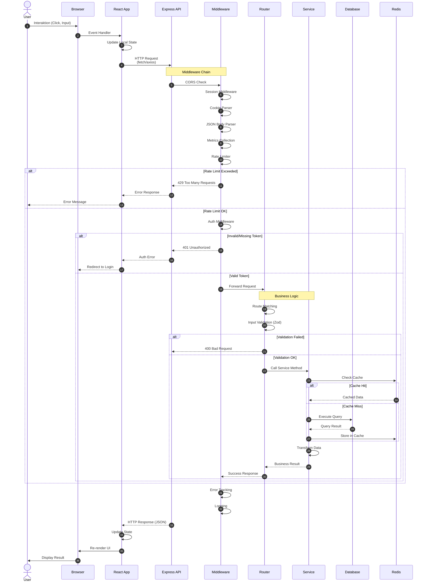
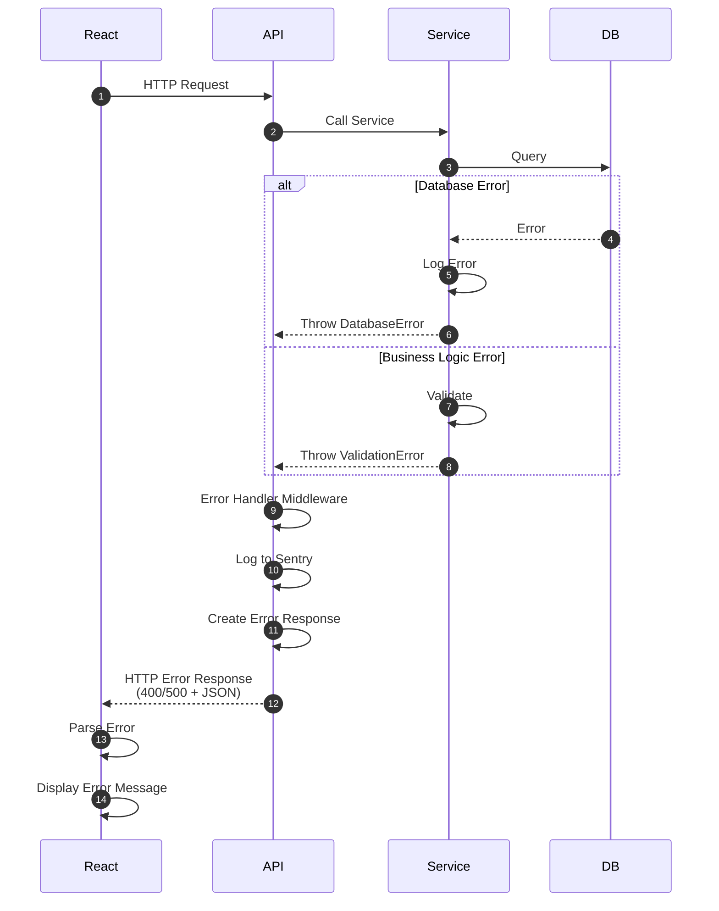

# Request Flow Diagram

**Version**: 1.0.0  
**Status**: Production Ready  
**Letzte Aktualisierung**: Dezember 2024  
**Maintainer**: Thomas Heisig

---

## 📋 Überblick

Dieses Dokument beschreibt den detaillierten Ablauf von HTTP-Anfragen durch
das ERP SteinmetZ System, von Frontend bis Database und zurück.

---

## 🔄 Standard API Request Flow



---

## 📝 Detaillierte Schritte

### Phase 1: Frontend (1-3)

#### 1. User Interaction
- **Trigger**: Click, Input, Submit, Navigation
- **Example**: User klickt "Create Document" Button
- **Action**: Event Handler wird aufgerufen

#### 2. React State Update
- **Optimistic UI**: Lokaler State wird sofort aktualisiert
- **Loading State**: Spinner/Skeleton wird angezeigt
- **Example**: 
  ```typescript
  const [loading, setLoading] = useState(false);
  setLoading(true);
  ```

#### 3. HTTP Request
- **Method**: GET, POST, PUT, DELETE, PATCH
- **Headers**: 
  - `Authorization: Bearer <token>`
  - `Content-Type: application/json`
  - `X-Request-ID: <uuid>` (für Tracing)
- **Body**: JSON-Payload (bei POST/PUT/PATCH)
- **Example**:
  ```typescript
  const response = await fetch('/api/documents', {
    method: 'POST',
    headers: {
      'Authorization': `Bearer ${token}`,
      'Content-Type': 'application/json',
    },
    body: JSON.stringify({ title, content }),
  });
  ```

---

### Phase 2: Middleware Chain (4-10)

#### 4. CORS Check
- **Middleware**: `cors()`
- **Prüfung**: Origin-Header gegen erlaubte Origins
- **Config**: `CORS_ORIGIN` ENV-Variable
- **Action**: 
  - OK: Weiter
  - Fehler: 403 Forbidden

#### 5. Session Middleware
- **Middleware**: `express-session` mit `connect-redis`
- **Prüfung**: Session-Cookie
- **Action**: 
  - Load Session aus Redis
  - Attach `req.session`
- **Fallback**: In-Memory Store (dev)

#### 6. Cookie Parser
- **Middleware**: `cookie-parser()`
- **Action**: Parse Cookies aus Request-Header
- **Attach**: `req.cookies`

#### 7. JSON Body Parser
- **Middleware**: `express.json()`
- **Action**: Parse JSON-Body
- **Limit**: 10MB (konfigurierbar)
- **Attach**: `req.body`

#### 8. Metrics Collection
- **Middleware**: `metricsMiddleware`
- **Action**: 
  - Request Counter erhöhen
  - Request Duration starten
- **Prometheus**: 
  ```
  http_requests_total{method="POST",route="/api/documents"}
  http_request_duration_seconds{method="POST",route="/api/documents"}
  ```

#### 9. Rate Limiter
- **Middleware**: `express-rate-limit`
- **Storage**: Redis (distributed)
- **Limits**:
  - General API: 100/15min
  - AI Endpoints: 20/15min
  - Auth Endpoints: 5/15min
- **Action**:
  - Unter Limit: Weiter
  - Über Limit: 429 Too Many Requests
- **Headers**:
  ```
  RateLimit-Limit: 20
  RateLimit-Remaining: 15
  RateLimit-Reset: 1702566000
  ```

#### 10. Auth Middleware
- **Middleware**: `authenticateToken()`
- **Action**:
  - Extract Token aus `Authorization` Header
  - Verify JWT mit `JWT_SECRET`
  - Load User aus Token Payload
  - Attach `req.user`
- **Fehler**:
  - Missing Token: 401 Unauthorized
  - Invalid Token: 401 Unauthorized
  - Expired Token: 401 Unauthorized (mit Refresh-Hinweis)

---

### Phase 3: Router & Business Logic (11-18)

#### 11-12. Route Matching
- **Router**: Express Router per Modul
- **Example**: `POST /api/documents` → `documentsRouter`
- **Path Parameters**: Extracted und verfügbar in `req.params`
- **Query Parameters**: Verfügbar in `req.query`

#### 13. Input Validation
- **Library**: Zod
- **Action**: Validate `req.body` gegen Schema
- **Example**:
  ```typescript
  const schema = z.object({
    title: z.string().min(1).max(200),
    content: z.string().optional(),
  });
  
  const validated = schema.parse(req.body);
  ```
- **Fehler**: 400 Bad Request mit detailliertem Error-Message

#### 14. Service Call
- **Pattern**: Router → Service → Database
- **Separation**: 
  - Router: HTTP-Logik, Validation
  - Service: Business Logic
  - Database: Data Access
- **Example**:
  ```typescript
  const document = await documentsService.create(
    req.user.id,
    validated.title,
    validated.content
  );
  ```

#### 15-16. Cache Check
- **Service**: Check Redis Cache zuerst
- **Key Pattern**: `cache:documents:list:${userId}`
- **TTL**: 5-15 Minuten (je nach Datentyp)
- **Action**:
  - Cache Hit: Return cached data
  - Cache Miss: Query Database

#### 17-18. Database Query
- **Service**: `dbService` (Abstraction Layer)
- **Driver**: SQLite (dev) oder PostgreSQL (prod)
- **Action**:
  - Prepare Statement
  - Execute Query
  - Transform Result
- **Monitoring**: Query Duration Tracking
- **Example**:
  ```typescript
  const result = await db.run(
    'INSERT INTO documents (title, content, user_id) VALUES (?, ?, ?)',
    [title, content, userId]
  );
  ```

---

### Phase 4: Response (19-23)

#### 19. Transform Data
- **Service**: Format Data für API-Response
- **Example**:
  ```typescript
  return {
    id: result.lastID,
    title,
    content,
    createdAt: new Date().toISOString(),
    userId,
  };
  ```

#### 20. Success Response
- **Router**: Send Response
- **Format**: JSON
- **Status Codes**:
  - 200 OK (GET)
  - 201 Created (POST)
  - 204 No Content (DELETE)
- **Example**:
  ```typescript
  res.status(201).json({
    success: true,
    data: document,
  });
  ```

#### 21. Error Tracking
- **Middleware**: `errorTrackingMiddleware`
- **Action**: 
  - Bei Fehler: Send zu Sentry
  - Include Stack Trace, Context, User Info
- **Throttling**: Nicht jeder Fehler (Rate Limiting)

#### 22. Logging
- **Service**: Structured Logger
- **Format**: JSON
- **Levels**: trace, debug, info, warn, error, fatal
- **Context**: Request-ID, User-ID, Duration
- **Example**:
  ```json
  {
    "level": "info",
    "time": "2024-12-14T10:30:00.000Z",
    "module": "documents",
    "message": "Document created",
    "requestId": "req-123",
    "userId": "user-456",
    "duration": 45
  }
  ```

#### 23-26. Frontend Update
- **React**: Receive Response
- **Action**:
  - Parse JSON
  - Update State
  - Re-render UI
  - Hide Loading Spinner
- **Error Handling**:
  - Display Error Message
  - Revert Optimistic Update
  - Offer Retry

---

## 🔍 Error Flow



---

## 🎯 Performance Optimierungen

### 1. Caching Strategy
- **L1 Cache**: Browser Cache (Static Assets)
- **L2 Cache**: Redis Cache (API Responses)
- **L3 Cache**: Database Query Cache

### 2. Response Time Targets
- **< 100ms**: Cached Responses
- **< 500ms**: Simple Database Queries
- **< 2000ms**: Complex Queries / AI Requests
- **< 5000ms**: Batch Processing

### 3. Connection Pooling
- **Database**: Max 20 Connections
- **Redis**: Max 10 Connections
- **AI Providers**: Max 5 concurrent Requests

---

## 📊 Monitoring

### Key Metrics

```prometheus
# Request Count
http_requests_total{method="POST",route="/api/documents",status="201"}

# Response Time
http_request_duration_seconds{method="POST",route="/api/documents"}

# Error Rate
http_requests_total{method="POST",route="/api/documents",status="500"}

# Cache Hit Rate
cache_hits_total / cache_requests_total

# Database Query Time
db_query_duration_seconds{query="insert_document"}
```

### Alerts

- **High Error Rate**: > 1% Fehler über 5 Minuten
- **Slow Response**: P95 > 2000ms über 5 Minuten
- **Low Cache Hit Rate**: < 70% über 10 Minuten

---

## 📚 Verwandte Dokumente

- [C4 Level 2: Container Diagram](./C4-LEVEL2-CONTAINER.md)
- [Error Handling](../ERROR_HANDLING.md)
- [Rate Limiting](../RATE_LIMITING.md)
- [Performance Features](../PERFORMANCE_FEATURES.md)

---

**Letzte Aktualisierung**: Dezember 2024  
**Maintainer**: Thomas Heisig  
**Nächster Review**: März 2025
